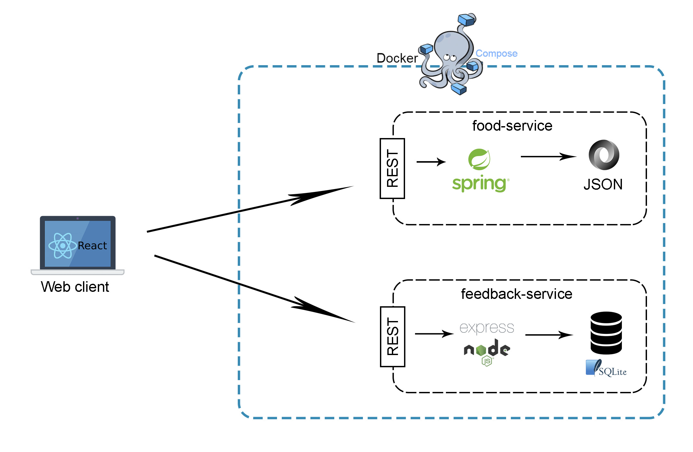
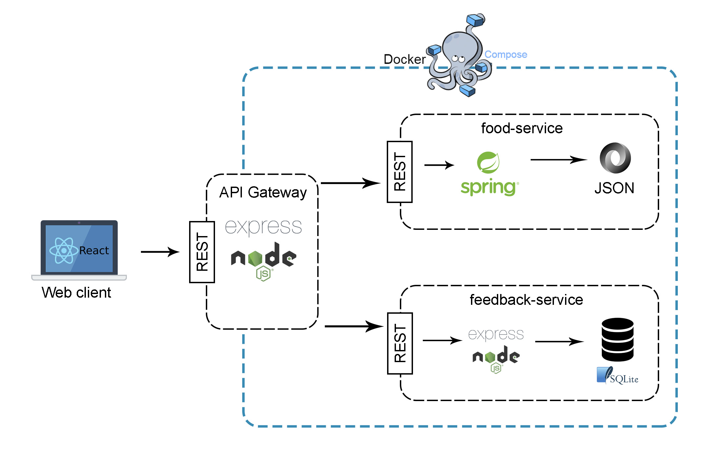
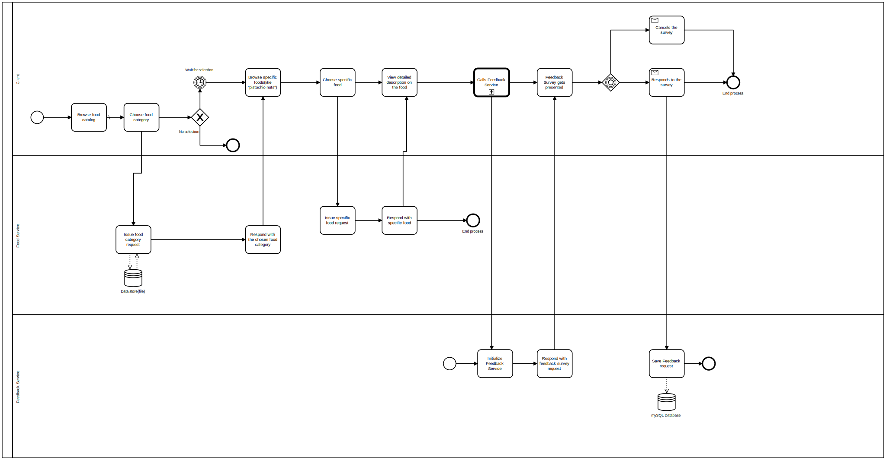
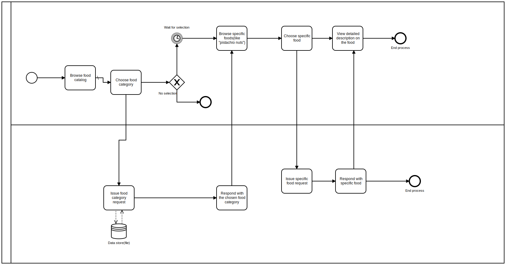

# The Food Information Encyclopedia

## Introduction

The Food Information Encyclopedia is now also selling food. This is managed by a legacy java spring system. We are however tasked with implementing a feedback service for collecting and storing user feedback.

## Overview

The web client is a react web app. The web app communicates with the backend which is build from a micro services architecture. The composition of the services are managed by docker-compose.

The food-service retrieves data about the foods which are stored in a JSON file. The service exposes a REST api for querying the food data. 

The feedback service stores feedback in a sqlite database. The service exposes a REST API which is implemented in Express.JS.

As a future improvement we would have liked to add an API gateway which all between frontend and the client should go through. However in the given time frame we did not manage to implement this.

## Business Processes 
**_Feedback service in our Food Encyclopedia system:_**

**_Food Encyclopedia system without the feedback process:_**

